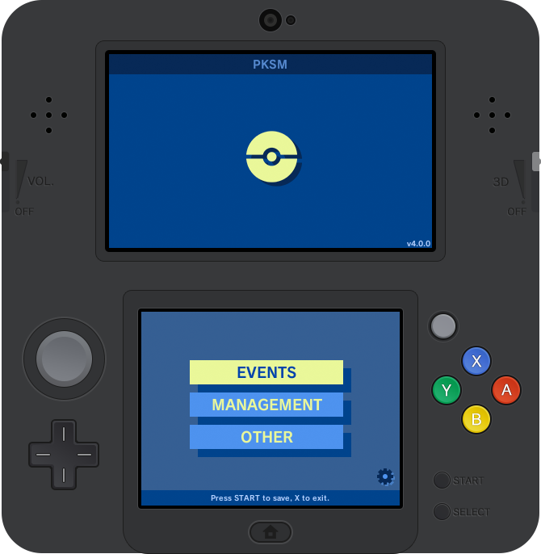
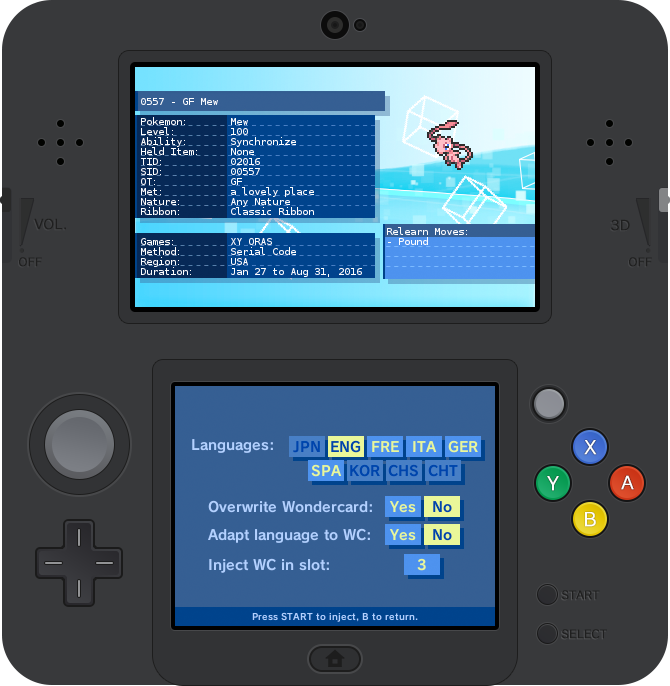
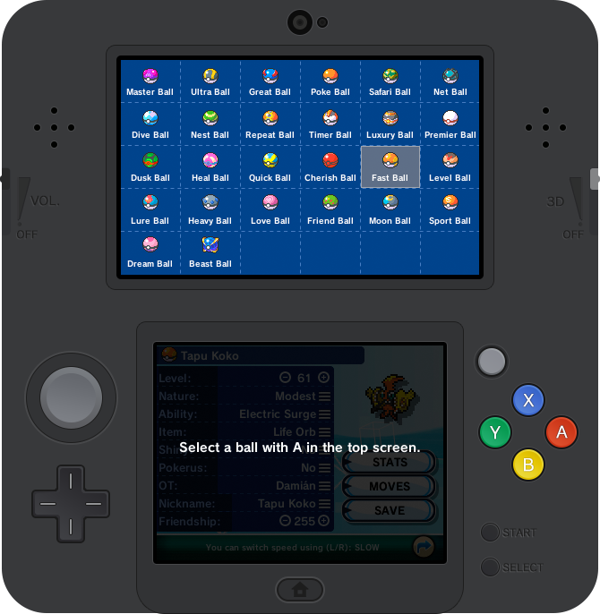
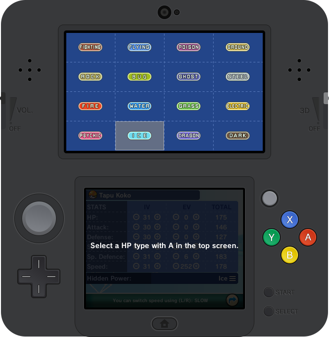
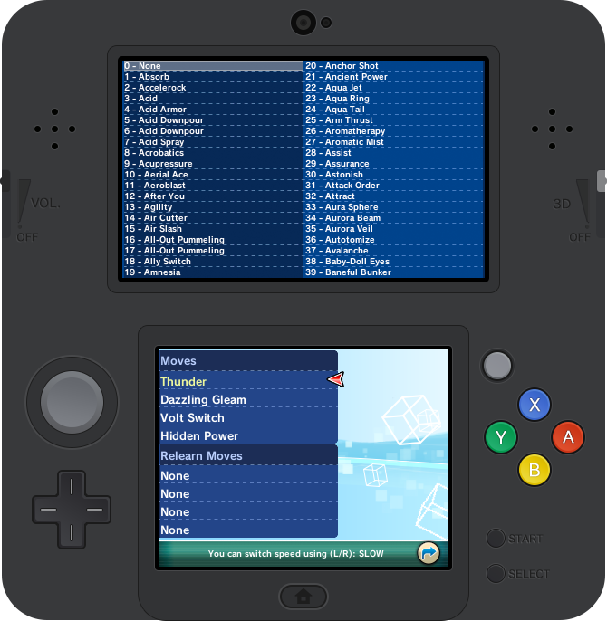

    
  

**Editor**, **wondercard injector**, **offline extra storage** and **OTA injector**.

If you want a non-invasive homebrew to see your save's infos, check out [**PKSV**](https://github.com/BernardoGiordano/PKSV)

| Downloads | Links |
| :-------: | :---: |
| Latest 3dsx build | [direct](https://github.com/BernardoGiordano/PKSM/releases/download/4.2.0/PKSM.zip) |
| Latest cfw build | [direct](https://github.com/BernardoGiordano/PKSM/releases/download/4.2.0/PKSM.cia) |
| Latest QR code | [qr](https://chart.googleapis.com/chart?chs=300x300&cht=qr&chl=https://github.com/BernardoGiordano/PKSM/releases/download/4.2.0/PKSM.cia&choe=UTF-8.png) |

## Backups

Automatic backups are located at ` /3ds/data/PKSM/backup/[GAME_DATE]/main `

## OTA injection

You can use servepkx to inject things from your PC to PKSM directly. Use your favourite version between the ones proposed here:

| Downloads | Links |
| :-------: | :---: |
| **Java** | [Usage](https://github.com/BernardoGiordano/PKSM/tree/master/servepkx/java) |
| **Python** | [Usage](https://github.com/BernardoGiordano/PKSM/tree/master/servepkx/python) |

## Installation

Download and install the latest release (4.2.0) with your favourite installation method. When booted, the application will download automatically the required additional assets from a third party source. You can provide your own assets, if you want.

If you're using Homebrew Launcher, make sure you have it updated to the [latest version](https://smealum.github.io/ninjhax2/starter.zip).

If you're using Homebrew Launcher and you don't have the latest firmware on your console, you may want to use **ctr-httpwn** to get internet access and let the application download everything correctly. If you can't still download them through the application, you can put them manually in the SD card, putting the external [additionalassets](https://github.com/dsoldier/PKResources) folder in your SD card, located at ` /3ds/data/PKSM/ `. To avoid troubles, the final result should be a folder filled with assets, located at ` /3ds/data/PKSM/additionalassets/ `.

## Compiling

You need devKitPro, ctrulib, sf2d, sfil, sftd and Xerpi's portlibs to be able to compile this.
When cloning the repo make sure to use `git clone --recursive` in order to also get buildtools.

Lastly in case you're compiling for homebrew usage ensure you also create an xml file with `<targets selectable="true"></targets>` and put it along side the `.3dsx` file with matching names.

## Screenshots

 
 
 
 
 
 
 
## Credits

* @dsoldier for the gorgeous graphic work
* @Anty-Lemon for joining the dev team
* Smealum for ctrulib, Xerpi for sf2d
* Kaphotics for PKHeX and being an awesome guy
* SciresM for C-memecrypto, you rock man
* J-K-D for direct save import/export and being awesome
* Slownic for java servepkx
* Slashcash for PCHex++ and Strackeror for PCHex
* Gocario for PKBrew
* TuxSH for TWLSaveTool
* MarcusD for romfs support
* Nba_Yoh for received flags fix
* Hamcha for cybertrust.h and digicert.h
* hirakujira for RNG seed function
* PPorg for most of wc6/wc7 included here
* Simona, Carlo, Matteo for fill.c work
* Shai, Federico, YodaDaCoda, /u/SatansRoommate for tests
* Alex, Immersion, Hat3Mond4ys, sgtkwol for descriptions
* Paul, Kian for a few wc6
* Majickhat55 for few collections and descriptions
* Poutros for N's collection

**If you appreciate my work, I appreciate [a coffee](https://www.paypal.me/BernardoGiordano) :)** 

## License

This file is part of PKSM

Copyright (C) 2016/2017 Bernardo Giordano

>    This program is free software: you can redistribute it and/or modify
>    it under the terms of the GNU General Public License as published by
>    the Free Software Foundation, either version 3 of the License, or
>    (at your option) any later version.
>
>    This program is distributed in the hope that it will be useful,
>    but WITHOUT ANY WARRANTY; without even the implied warranty of
>    MERCHANTABILITY or FITNESS FOR A PARTICULAR PURPOSE.  See the
>    GNU General Public License for more details.
>
>    You should have received a copy of the GNU General Public License
>    along with this program.  If not, see <http://www.gnu.org/licenses/>.
>    See LICENSE for information.